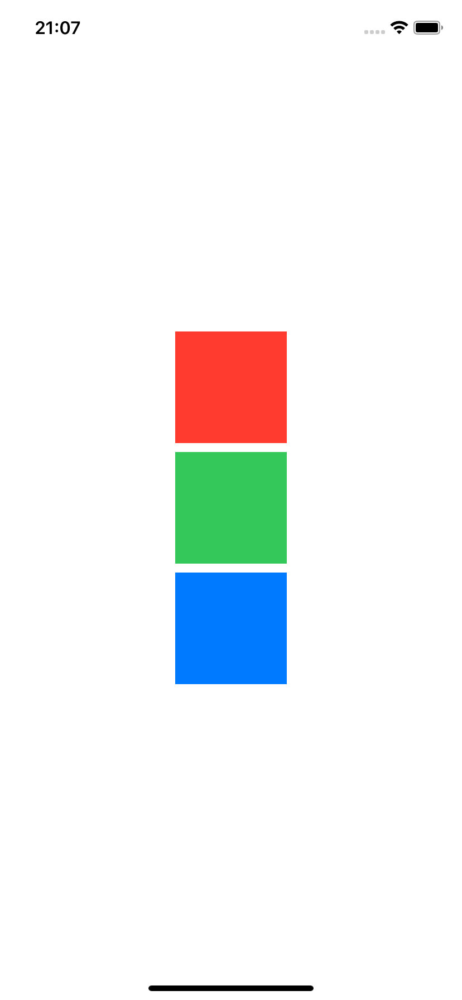
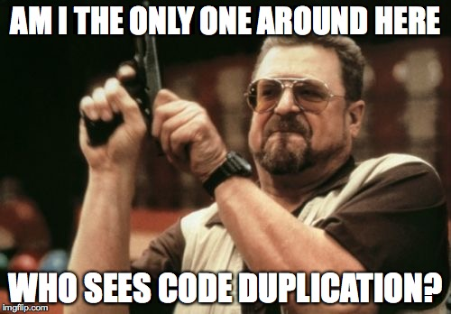

# Unlocking SwiftUI’s Hidden Potential: Leveraging ViewModifiers

Unlocking the true potential of SwiftUI often comes down to mastering its powerful tools and components. Among these tools are ViewModifiers — the unsung heroes that encapsulate reusable styling and behavior across SwiftUI views. These simple yet versatile modifiers empower developers to efficiently configure and apply consistent changes to views throughout the application.

<div align="center">

|  | 
|:--:| 
| *Such transformation in nature works similarly to our topic* |
</div>

In this article, we’ll delve into the world of SwiftUI’s ViewModifiers, exploring their significance, versatility, and the incredible impact they bring to UI development. Join me on this journey as we uncover the magic behind SwiftUI’s ViewModifiers and how they streamline the creation of beautiful, consistent user interfaces in your app development projects.

<div align="center">
. . .
</div>

The utilization of ViewModifiers have caught my attention several times within relatively large projects — and initially, it’s quite impressive. Nonetheless, it might be wise to pay attention to a few aspects: in my opinion, developers often struggle with determining the appropriate use cases for ViewModifiers, and whether using one is the right call in a given situation.

This article doesn’t offer a TL;DR summary — take the plunge and read through, because the real gems lie in exploring the numerous examples. However, feel free to skim through or dive into the content; either way, the downloadable project is available at the end of this story.

<div align="center">
. . .
</div>

The article is divided into four parts:
- [firstly](#part-i--what-is-a-viewmodifier-why-should-i-use-it-how-can-i-implement-one), I’ll illustrate how far various descriptions typically go,
- [secondly](#part-ii--how-can-we-take-advantage-of-viewmodifiers), you’ll discover how to master the usage of `ViewModifier`s and how they can assist you in creating reusable components,
- [next](#part-iii--case-study-with-a-real-world-component), a case study demonstrates how `ViewModifier`s can effectively alleviate real-world issues, and
- [finally](#part-iv--miscellaneous-things-to-consider), I provide a brief summary and notes for further exploration.

_Note: all examples, including the final code, are based on Xcode 15.0 and Swift 5.9, with a minimum OS version is set to iOS 17.0. At all codeblocks there will be a GitHub link for that stage of code._

<div align="center">
. . .
</div>

## Part I — What is a ViewModifier? Why should I use it? How can I implement one?

According to [the SwiftUI documentation](https://developer.apple.com/documentation/swiftui/viewmodifier), a `ViewModifier` is

> a modifier that you apply to a view or another view modifier, producing a different version of the original value

and it’s recommended to

> adopt the ViewModifier protocol when you want to create a reusable modifier that you can apply to any view.

Sounds _concise_, right? I believe that the majority of the people appreciate practical demonstrations, so let’s see it in action!

<div align="center">
. . .
</div>

Let’s kick off with a simple example: imagine a scenario where several `View`s share some common characteristics. Using a `ViewModifier` can be an excellent strategy in this case — it aids in avoiding repetitive code and circumventing duplication. Our initial objective is to render three equally sized squares arranged in a vertical stack.

<div align="center">

|  | 
|:--:| 
| *Our desired UI* |
</div>

The first solution can be something like this ([link](https://github.com/stateman92/Medium-ViewModifier/commit/610fbee28cbbf7e0f3395b92beb5675516baac49)):

```swift
struct ContentView: View {
    var body: some View {
        VStack {
            Color.red
                .frame(width: 100, height: 100)

            Color.green
                .frame(width: 100, height: 100)

            Color.blue
                .frame(width: 100, height: 100)
        }
    }
}

#Preview {
    ContentView()
}
```

<div align="center">

|  | 
|:--:| 
| *An image about our initial code* |
</div>

The squares have been created, and if we extract the constants, the result will be slightly better ([link](https://github.com/stateman92/Medium-ViewModifier/commit/29890b83e0f2677b5dceb0129966b01c3cc68477)):

```swift
struct ContentView: View {
    private enum Constants {
        static let size = 100.0
    }

    var body: some View {
        VStack {
            Color.red
                .frame(width: Constants.size, height: Constants.size)

            Color.green
                .frame(width: Constants.size, height: Constants.size)

            Color.blue
                .frame(width: Constants.size, height: Constants.size)
        }
    }
}

#Preview {
    ContentView()
}
```

This is where the concept of `ViewModifier` might come to the developers’ mind: creating one to extract common code. How do we create one?

<div align="center">
. . .
</div>

> A `ViewModifier` has only one required function to implement, namely `func body(content: Content) -> some View`, where `content` represents the `View` the modifier will be applied to and then it’ll be returned. Its usage is quite straightforward, as there’s a function defined on the `View` called `.modifier()`:

> ```swift
> struct CustomModifier: ViewModifier {
>     func body(content: Content) -> some View {
>         content
>             .padding() // or any other transformation of the view
>     }
> }
> ```

<div align="center">
. . .
</div>

Back to our main task, we can create a custom `ViewModifier` for this usage ([link](https://github.com/stateman92/Medium-ViewModifier/commit/8147cbf88141130ed3aec90a63d47bcbb667dc9c)):

```swift
private struct SizeModifier: ViewModifier {
    private enum Constants {
        static let size = 100.0
    }

    func body(content: Content) -> some View {
        content
            .frame(width: Constants.size, height: Constants.size)
    }
}

struct ContentView: View {
    var body: some View {
        VStack {
            Color.red
                .modifier(SizeModifier())

            Color.green
                .modifier(SizeModifier())

            Color.blue
                .modifier(SizeModifier())
        }
    }
}

#Preview {
    ContentView()
}
```

The `.modifier()` call is duplicated, and even worse, the `SizeModifier` is hardcoded into three lines. We can easily add an extension method for the `View` ([link](https://github.com/stateman92/Medium-ViewModifier/commit/5a0c064abf6b004d865c1ec3fa354570fbf15c6d)):

> Lesson learned: if we encounter a `.modifier()` call with a constant modifier, it might immediately strike us that we can put this into a `View` extension, making it more elegant.

```swift
struct ContentView: View {
    var body: some View {
        VStack {
            Color.red
                .applySize()

            Color.green
                .applySize()

            Color.blue
                .applySize()
        }
    }
}

private struct SizeModifier: ViewModifier {
    private enum Constants {
        static let size = 100.0
    }

    func body(content: Content) -> some View {
        content
            .frame(width: Constants.size, height: Constants.size)
    }
}

extension View {
    fileprivate func applySize() -> some View {
        modifier(SizeModifier())
    }
}

#Preview {
    ContentView()
}
```

If the `ViewModifier` is used in this manner, it could be the limit of far we need or should go with it. However, it might become noticeable that our custom modifier is used only in a single place. Should we remain within the file scope, we could write something similar to this ([link](https://github.com/stateman92/Medium-ViewModifier/commit/b1a30d19fdeb034de8e362c9feb5fd18454a4565)):

```swift
struct ContentView: View {
    var body: some View {
        VStack {
            Color.red
                .applySize()

            Color.green
                .applySize()

            Color.blue
                .applySize()
        }
    }
}

extension View {
    fileprivate func applySize() -> some View {
        frame(width: 100, height: 100)
    }
}

#Preview {
    ContentView()
}
```

At this stage, we’ve essentially returned to the same starting point, only without the `ViewModifier`'s involvement — the code hasn’t gotten worse or become less readable. If anything, it seems less complex now. But then, you might ask, why bother with a `ViewModifier` at all? 🤔 Fear not, there’s plenty more to explore!

<div align="center">
. . .
</div>

## Part II — How can we take advantage of ViewModifiers?

Now, let’s consider a rather complex `View`! For this instance, let’s implement two texts placed side by side with minimal customization ([link](https://github.com/stateman92/Medium-ViewModifier/commit/65ea3634a623adbe5dfb987853908199d147bce1)):

```swift
struct ContentView: View {
    var body: some View {
        SomeComplexView(title: "Title", details: "Details")
    }
}

struct SomeComplexView: View {
    let title: String
    let details: String

    var body: some View {
        HStack {
            Text(title)
                .font(.title)
                .bold()
                .padding()

            Text(details)
                .font(.callout)
                .italic()
        }
    }
}

#Preview {
    ContentView()
}
```

Let’s assume this component is ready and extensively used throughout an application. However, due to the design team’s decision, we are now required to add a 3-point wide blue border around the text with the title, without disrupting its existing usage. This means we cannot rewrite the View entirely from scratch due to its complexity, as it might introduce unforeseen issues. Therefore, all solutions must be backward-compatible, requiring minimal modifications. Initially, here’s how I would approach it as a first step, acknowledging that _this isn’t close to the optimal solution yet_ ([link](https://github.com/stateman92/Medium-ViewModifier/commit/4912b7d6eb62f1fba72c002b9258444adc10672f)):

```swift
struct ContentView: View {
    var body: some View {
        VStack {
            SomeComplexView(title: "Title", details: "Details")
            SomeComplexView(title: "Title", details: "Details", hasBorder: true)
        }
    }
}

struct SomeComplexView: View {
    private let title: String
    private let details: String
    private let hasBorder: Bool

    init(title: String, details: String, hasBorder: Bool = false) {
        self.title = title
        self.details = details
        self.hasBorder = hasBorder
    }

    var body: some View {
        HStack {
            Text(title)
                .font(.title)
                .bold()
                .padding()
                .border(hasBorder ? .blue : .clear, width: hasBorder ? 3 : 0)

            Text(details)
                .font(.callout)
                .italic()
        }
    }
}

#Preview {
    ContentView()
}
```

It definitely works, and it remains backward compatible (as you can see in the first part of the `ContentView`) due to the default parameter. Suppose someone returns to this code after a significant period and is asked to change the width to 5 points from this point forward (without altering previous instances), I’m pretty sure the result might look something like this, but I highlight that _the example is for illustration purposes_, and it might resemble something this complex ([link](https://github.com/stateman92/Medium-ViewModifier/commit/51bc0b7be5d6c44ab74f6e06aa44836ccfe44643)):

```swift
struct ContentView: View {
    var body: some View {
        VStack {
            SomeComplexView(title: "Title", details: "Details")
            SomeComplexView(title: "Title", details: "Details", hasBorder: true)
            SomeComplexView(title: "Title", details: "Details", hasBorder: true, hasThickBorder: true)
        }
    }
}

struct SomeComplexView: View {
    private let title: String
    private let details: String
    private let hasBorder: Bool
    private let hasThickBorder: Bool

    init(title: String, details: String, hasBorder: Bool = false, hasThickBorder: Bool = false) {
        self.title = title
        self.details = details
        self.hasBorder = hasBorder
        self.hasThickBorder = hasThickBorder
    }

    var body: some View {
        HStack {
            Text(title)
                .font(.title)
                .bold()
                .padding()
                .border(hasBorder ? .blue : .clear, // or: hasBorder || hasThickBorder ? .blue : .clear
                        width: hasThickBorder ? 5 : (hasBorder ? 3 : 0))

            Text(details)
                .font(.callout)
                .italic()
        }
    }
}

#Preview {
    ContentView()
}
```

It can do its job, but what does it really mean when I call it with `hasBorder: false` and `hasTickBorder: true` values? According to the above implementation, the view won’t have a border (if I implement it based on the comment in the code, however, everything would be correct as stated, but there will still be a border). Not very user-friendly, but if called with the right configuration, at least it works. The problem arises here: how many more parameters do we need to add and support later? A valid strategy might be organizing these into a separate struct, which is fine for now — but after some time they will likely interfere with each other, that could lead to nightmares.

<div align="center">
. . .
</div>

Let’s tackle the problem from another point of view: introduce customization options from the outside world, so that each view can do it the way it wants. Let's assume we are seasoned UIKit developers and we have experience with it, so it might look something like this based on our previous understandings ([link](https://github.com/stateman92/Medium-ViewModifier/commit/389cc8f8aa83bc53f579c6b00f77be8325cc4c6b)):

```swift
struct ContentView: View {
    var body: some View {
        VStack {
            SomeComplexView(title: "Title", details: "Details")
            SomeComplexView(title: "Title", details: "Details") {
                AnyView($0.border(.blue, width: 3))
            }
        }
    }
}

struct SomeComplexView<ModifiedView: View>: View {
    let title: String
    let details: String
    let customization: (any View) -> ModifiedView

    var body: some View {
        HStack {
            customization(
                Text(title)
                    .font(.title)
                    .bold()
                    .padding()
            )

            Text(details)
                .font(.callout)
                .italic()
        }
    }
}

extension SomeComplexView where ModifiedView == AnyView {
    init(title: String, details: String) {
        self.title = title
        self.details = details
        self.customization = { AnyView($0) }
    }
}

#Preview {
    ContentView()
}
```

It works, and there’s not much to mess up, but that `AnyView` isn’t just unaesthetic; it can backfire later (especially with animations), so it’s not an ideal choice at all. Here, it’s noticeable that we’re fighting against SwiftUI, the solution isn’t as smooth as it should be — if `AnyView` is used without a real reason, it should immediately raise a red flag. This is where the existence of `ViewModifier`s should come to mind. Let’s say something like this ([link](https://github.com/stateman92/Medium-ViewModifier/commit/3dddd22f9279f45f08d9c830b4884a20044fe2ac)):

```swift
struct ContentView: View {
    var body: some View {
        VStack {
            SomeComplexView(title: "Title", details: "Details")
            SomeComplexView(title: "Title", details: "Details", titleModifier: SomeComplexViewTitleModifier())
        }
    }
}

struct SomeComplexView<TitleModifier: ViewModifier>: View {
    let title: String
    let details: String
    let titleModifier: TitleModifier

    var body: some View {
        HStack {
            Text(title)
                .font(.title)
                .bold()
                .padding()
                .modifier(titleModifier)

            Text(details)
                .font(.callout)
                .italic()
        }
    }
}

extension SomeComplexView where TitleModifier == EmptyModifier {
    init(title: String, details: String) {
        self.title = title
        self.details = details
        self.titleModifier = EmptyModifier()
    }
}

struct SomeComplexViewTitleModifier: ViewModifier {
    func body(content: Content) -> some View {
        content
            .border(.blue, width: 3)
    }
}

#Preview {
    ContentView()
}
```

If someone later decides that the border should be 5 points wide or that there should be an additional padding, then we can write ([link](https://github.com/stateman92/Medium-ViewModifier/commit/3b8bdc56922ce497241991c89314ab9f1f337e06)):

```swift
struct ContentView: View {
    var body: some View {
        VStack {
            SomeComplexView(title: "Title", details: "Details")
            SomeComplexView(title: "Title", details: "Details", titleModifier: SomeComplexViewTitleModifier())
            SomeComplexView(title: "Title", details: "Details", titleModifier: SomeComplexViewTitleModifier(extraPadding: true))
        }
    }
}

struct SomeComplexView<TitleModifier: ViewModifier>: View {
    let title: String
    let details: String
    let titleModifier: TitleModifier

    var body: some View {
        HStack {
            Text(title)
                .font(.title)
                .bold()
                .padding()
                .modifier(titleModifier)

            Text(details)
                .font(.callout)
                .italic()
        }
    }
}

extension SomeComplexView where TitleModifier == EmptyModifier {
    init(title: String, details: String) {
        self.title = title
        self.details = details
        self.titleModifier = EmptyModifier()
    }
}

struct SomeComplexViewTitleModifier: ViewModifier {
    private let color: Color
    private let width: CGFloat
    private let extraPadding: Bool

    init(color: Color = .blue, width: CGFloat = 3, extraPadding: Bool = false) {
        self.color = color
        self.width = width
        self.extraPadding = extraPadding
    }

    func body(content: Content) -> some View {
        content
            .border(color, width: width)
            .padding(extraPadding ? 16 : 0)
    }
}

#Preview {
    ContentView()
}
```

Finally, if we don’t want to handle everything generically, the `View` doesn’t have to accept every `ViewModifier` in such a way ([link](https://github.com/stateman92/Medium-ViewModifier/commit/76ddf9cae9d9a7d107827a18582c96e64ce8ee2b)):

```swift
struct ContentView: View {
    var body: some View {
        VStack {
            SomeComplexView(title: "Title", details: "Details")
            SomeComplexView(title: "Title", details: "Details", titleModifier: .init())
            SomeComplexView(title: "Title", details: "Details", titleModifier: .init(color: .red, width: 5))
        }
    }
}

struct SomeComplexView: View {
    private let title: String
    private let details: String
    private let titleModifier: TitleViewModifier

    init(title: String, details: String, titleModifier: TitleViewModifier = .empty) {
        self.title = title
        self.details = details
        self.titleModifier = titleModifier
    }

    var body: some View {
        HStack {
            Text(title)
                .font(.title)
                .bold()
                .padding()
                .modifier(titleModifier)

            Text(details)
                .font(.callout)
                .italic()
        }
    }
}

struct TitleViewModifier: ViewModifier {
    private let color: Color
    private let width: CGFloat

    static var empty: Self {
        .init(color: .clear, width: .zero)
    }

    init(color: Color = .blue, width: CGFloat = 3) {
        self.color = color
        self.width = width
    }

    func body(content: Content) -> some View {
        content
            .border(color, width: width)
    }
}

#Preview {
    ContentView()
}
```

<div align="center">
. . .
</div>

## Part III — Case study with a real-world component

If we develop a custom UI component in a library, even at our greatest effort, there will eventually be missing parts. For instance there can be a custom view, that always shows its content below a segmented control, but what if the user of the library wants to add a red border to the segmented control? It cannot be accessed from outside, so the code will be thrown away, and it has to be implemented again.

For the abovementioned UI this code works fine on its own, but it’s kinda rigid, as I mentioned we cannot extend it from the outside ([link](https://github.com/stateman92/Medium-ViewModifier/commit/1daa56086a4baa98ab8bace01157e35aaf7fc7fb)):

```swift
struct ContentView: View {
    enum Tab: String, CaseIterable {
        case first
        case second
    }

    @State private var selectedTab: Tab = .first

    var body: some View {
        SegmentedControl(
            tabs: Tab.allCases,
            selectedTab: $selectedTab,
            title: \.rawValue
        ) { tab in
            switch tab {
            case .first: Color.red
            case .second: Color.blue
            }
        }
    }
}

struct SegmentedControl<Tab: Hashable, Content: View>: View {
    private let tabs: [Tab]
    @Binding private var selectedTab: Tab
    private let title: (Tab) -> String
    @ViewBuilder private let content: (Tab) -> Content

    init(
        tabs: [Tab],
        selectedTab: Binding<Tab>,
        title: @escaping (Tab) -> String,
        @ViewBuilder content: @escaping (Tab) -> Content
    ) {
        self.tabs = tabs
        self._selectedTab = selectedTab
        self.title = title
        self.content = content
    }

    var body: some View {
        VStack {
            Picker("", selection: $selectedTab) {
                ForEach(tabs, id: \.self) { tab in
                    Text(title(tab)).tag(tab)
                }
            }
            .pickerStyle(.segmented)

            content(selectedTab)
        }
    }
}

#Preview {
    ContentView()
}
```

If we think it through, using the same API we can implement the `View` using a `ViewModifier`. Then, the used `Picker` can be easily extended and customized. Due to the second `init`, this new version can be used in exactly the same way as the previous one. It’s best if we implement the `View` using the `ViewModifier` from the beginning, as later on, there will be one less thing triggering a change in the code ([link](https://github.com/stateman92/Medium-ViewModifier/commit/b56ce87e3479db1049aec02159c3b68e15509f42)):

```swift
struct BorderModifier: ViewModifier {
    func body(content: Content) -> some View {
        content
            .border(.red)
    }
}

struct ContentView: View {
    enum Tab: String, CaseIterable {
        case first
        case second
    }

    @State private var selectedTab: Tab = .first

    var body: some View {
        VStack {
            SegmentedControl(
                tabs: Tab.allCases,
                selectedTab: $selectedTab,
                title: \.rawValue
            ) { tab in
                switch tab {
                case .first: Color.red
                case .second: Color.blue
                }
            }

            SegmentedControl(
                tabs: Tab.allCases,
                selectedTab: $selectedTab,
                title: \.rawValue,
                modifier: BorderModifier()
            ) { tab in
                switch tab {
                case .first: Color.red
                case .second: Color.blue
                }
            }
        }
    }
}

struct SegmentedControl<Tab: Hashable, Content: View, Modifier: ViewModifier>: View {
    private let tabs: [Tab]
    @Binding private var selectedTab: Tab
    private let title: (Tab) -> String
    private let modifier: Modifier
    @ViewBuilder private let content: (Tab) -> Content

    init(
        tabs: [Tab],
        selectedTab: Binding<Tab>,
        title: @escaping (Tab) -> String,
        modifier: Modifier,
        @ViewBuilder content: @escaping (Tab) -> Content
    ) {
        self.tabs = tabs
        self._selectedTab = selectedTab
        self.title = title
        self.modifier = modifier
        self.content = content
    }

    var body: some View {
        VStack {
            Picker("", selection: $selectedTab) {
                ForEach(tabs, id: \.self) { tab in
                    Text(title(tab)).tag(tab)
                }
            }
            .pickerStyle(.segmented)
            .modifier(modifier)

            content(selectedTab)
        }
    }
}

extension SegmentedControl where Modifier == EmptyModifier {
    init(
        tabs: [Tab],
        selectedTab: Binding<Tab>,
        title: @escaping (Tab) -> String,
        @ViewBuilder content: @escaping (Tab) -> Content
    ) {
        self.init(
            tabs: tabs,
            selectedTab: selectedTab,
            title: title,
            modifier: EmptyModifier(),
            content: content
        )
    }
}

#Preview {
    ContentView()
}
```

By keeping this in mind, we not only extract common code and avoid code duplication, but we also prevent components from being discarded, as they become more customizable without any additional work. However, if we implement a more rigid UI (as in the first example), the code cannot adapt to dynamically changing environments and requirements. In other words,

> software should be flexible, that can be easily achieved with the utilization of the `ViewModifier`s.

I would like to emphasize my message to my fellow developers: it’s worth implementing a view with fundamental customization options (_not yet the actual customizations but the possibility to extend them_), rather than racking our own brains later over implementing new features while cautiously avoiding any disruptions and unintended modifications.

<div align="center">
. . .
</div>

## Part IV — Miscellaneous. Things to consider

At the start, you might wonder why to use `ViewModifier`s when you’re already constructing large, high-quality iOS applications without them. While `ViewModifier`s can be replaced, they undeniably offer several advantages that are worth understanding.

Here’s a brief list highlighting their benefits:

- **Avoiding Code Redundancy**: `ViewModifier`s help in reusing code when several views need to be styled similarly across different parts of the app,
- **Modularity**: they aid in separating the app’s style from its logic. For instance, you can create a `ViewModifier` that sets the text style, abstracting away text formatting details,
- **Clarity**: utilizing them in code streamlines the consistent appearance of views. For instance, consolidating button appearance settings within a `ViewModifier` enhances readability,
- **Flexible Customization**: `ViewModifier`s allow for easy customization, enabling the use of variables to dynamically alter a view’s behavior or appearance.

Ultimately, `ViewModifier`s facilitate code maintenance, readability, and scalability while offering flexibility to avoid repetitive coding and dynamically adjust the appearance and behavior across various parts of the application.

<div align="center">
. . .
</div>

However, if you decide to use `ViewModifier`s and go beyond the average usage, you might consider the followings:

- **Complex configurations**: for instance combining color and width might not necessarily need to be encapsulated within a single `ViewModifier`. While the demonstration showcased this, real-world scenarios might prompt us to pause and consider which parts should be enclosed within a `ViewModifier`. There are cases where we may not know exactly what will be encompassed in the modifier (refer to the third part of this article),
- **Dependency Injection** (DI): after the last step, using dependency injection for modifiers becomes feasible. This approach provides the capability to entirely transform the application’s appearance. However, this requires a different mode of thinking, making it a story fit for another article.

Undoubtedly, there are various other solutions out there; we’ve all witnessed different hacks (related to bend the frames of the different UI frameworks) or approaches. However, I trust the insights provided above might provide some value to you. Though it’s not as prevalent in our realm, [a similar concept](https://developer.android.com/reference/kotlin/androidx/compose/ui/Modifier#summary) is utilized in Android as well (`Modifier`). For those curious, the code snippet on the link (above the Summary part) illustrates its application with the Kotlin language.

[Here is the link to the repo](https://github.com/stateman92/Medium-ViewModifier), where you can find all the code above.

<div align="center">
. . .
</div>

I hope you found this article engaging and insightful. If it resonated with you and you found it helpful, please consider giving it a clap and share it to make it more discoverable for others! Should you have any questions, feel free to ask or follow me, and I’ll endeavor to address them ⚡️
